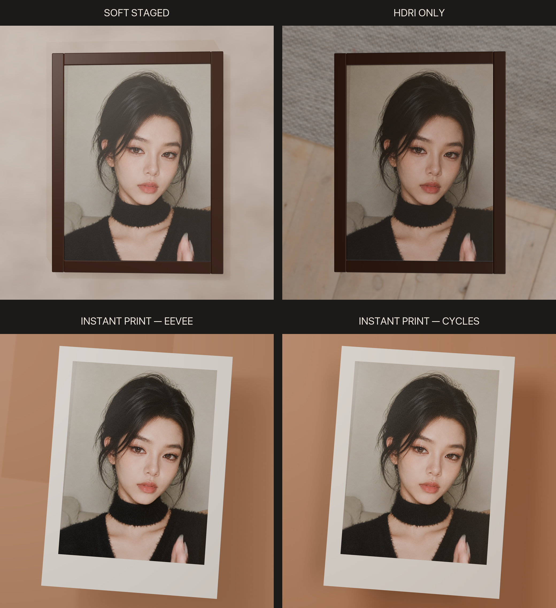

# Framed Selfie — Eevee and Cycles project

This is an unpacked Blender 5.2 project with three Eevee treatments and one
Cycles counterpart of the same unmodified 3:4 portrait. Each Blender file is intentionally small and
references the one shared portrait and one shared Poly Haven HDRI using
relative paths.



## Versions

- `01_soft_staged`: dark-walnut framed portrait on warm plaster, with one soft
  Area light and the shared HDRI.
- `02_hdri_only`: exactly one framed-portrait mesh plus one camera; no lights,
  wall, floor, empties, reflectors, or compositor effects.
- `03_instant_print`: unbranded instant-photo paper with a larger white bottom
  border, a gentle handheld tilt and curl, glossy uneven emulsion, and subtle
  paper grain. The effect is applied to the physical print, not to the source
  portrait pixels.
- `04_instant_print_cycles`: the exact same instant-print geometry, materials,
  camera, HDRI, and Area light rendered in Cycles on the Apple Metal GPU at
  128 adaptive samples with OpenImageDenoise.

## Project layout

```text
assets/       shared selfie, HDRI, and Poly Haven source note
blends/       one unpacked .blend file per version
renders/      four 2048x2048 PNGs plus full and engine comparisons
manifests/    per-version settings, hashes, object counts, and render timings
scripts/      reproducible builder, comparison maker, and verifier
project_manifest.json
```

The Blender image paths are:

```text
//../assets/selfie.png
//../assets/studio_country_hall_4k.exr
```

Move or copy the complete repository folder to keep those links
working. No image is packed into any `.blend`, and Blender backup files are
disabled by the builder.

## Rebuild and verify

Run from the repository root:

```sh
/Applications/Blender.app/Contents/MacOS/Blender \
  --background --factory-startup \
  --python scripts/build_project.py -- --render

# Rebuild only the Cycles instant print:
/Applications/Blender.app/Contents/MacOS/Blender \
  --background --factory-startup \
  --python scripts/build_project.py \
  -- --scope 04_instant_print_cycles --render

python3 -m venv .venv
.venv/bin/pip install -r requirements.txt
.venv/bin/python \
  scripts/make_comparison.py

/Applications/Blender.app/Contents/MacOS/Blender \
  --background --factory-startup \
  --python scripts/verify_project.py
```

The builder verifies the shared asset hashes before creating anything. The
verifier reopens every Blender file, reloads both relative image paths, checks
that nothing is packed, confirms full-source UV coverage, validates the Eevee,
Cycles, Metal, and camera settings, checks that both instant-print scene builds
are identical except for the engine, and enforces the two-object/zero-light
HDRI-only scene.

Poly Haven source and CC0 details are in `assets/POLYHAVEN_SOURCE.md`.
